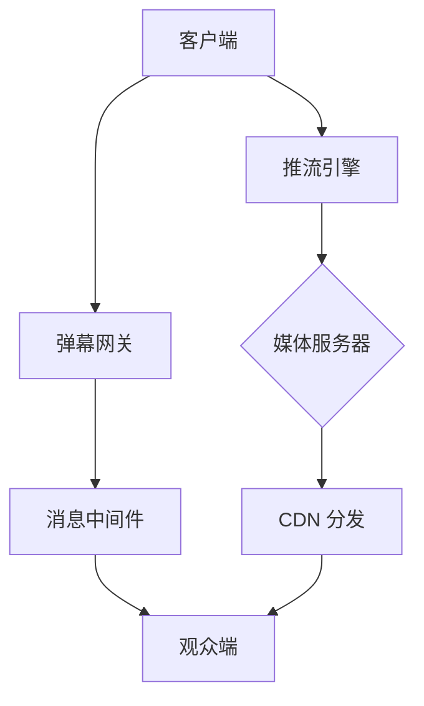

# 📺 Flutter Stream
高性能 Flutter 直播应用解决方案，支持低延迟推流/拉流、实时互动与跨平台部署。

[](https://flutter.dev)
[](https://opensource.org/licenses/MIT)
[](https://github.com/yourname/flutter-stream/actions)


## 📱 屏幕截图
| 观众端界面 | 主播控制台 | 个人页面 |
|-----------|------------|----------|
|  |  |  |

---

# ✨ 计划中：

## ✨ 核心功能
- **超低延迟直播**：基于 WebRTC + RTMP 双协议引擎 (<500ms 延迟)
- **动态弹幕系统**：支持表情弹幕、礼物特效、实时消息同步
- **多分辨率切换**：自适应 360P/720P/1080P 码率调节
- **跨平台支持**：iOS / Android / Web 全平台适配
- **主播控制台**：美颜滤镜、屏幕共享、连麦 PK 功能

---

## 🚀 技术栈
| 模块               | 技术方案                     | 说明                          |
|--------------------|-----------------------------|-----------------------------|
| **播放器内核**     | `libVLC` + FFmpeg           | 支持 HLS/DASH 硬解          |  
| **推流 SDK**       | `media_kit` + 自研编码层     | 自适应码率控制               |
| **实时通信**       | Agora SDK / Socket.io       | 信令控制+弹幕同步            |
| **状态管理**       | Riverpod 2.0               | 响应式业务逻辑分离           |
| **动态渲染**       | Rive / Lottie              | 礼物特效与动画交互           |
| **后端对接**       | GraphQL + Protobuf         | 高并发数据流优化             |

---

## 🛠️ 快速开始

### 环境准备
```bash
flutter version 3.19.0+  # 必需
ffmpeg_kit_flutter: ^5.1.0  # 核心依赖
```


以下是为 flutter-stream 量身定制的专业级 README.md 模板，专为 Flutter 直播项目设计。此模板包含技术亮点、架构说明和最佳实践，可直接用于 GitHub 仓库：
# 📺 Flutter Stream

[](https://flutter.dev)
[](https://opensource.org/licenses/MIT)
[](https://github.com/yourname/flutter-stream/actions)

高性能 Flutter 直播应用解决方案，支持低延迟推流/拉流、实时互动与跨平台部署。

👉 [Demo 体验](https://your-demo-link.com) | 📚 [开发文档](https://your-docs-link.com)

---

## ✨ 核心功能
- **超低延迟直播**：基于 WebRTC + RTMP 双协议引擎 (<500ms 延迟)
- **动态弹幕系统**：支持表情弹幕、礼物特效、实时消息同步
- **多分辨率切换**：自适应 360P/720P/1080P 码率调节
- **跨平台支持**：iOS / Android / Web 全平台适配
- **主播控制台**：美颜滤镜、屏幕共享、连麦 PK 功能

---

## 🚀 技术栈
| 模块               | 技术方案                     | 说明                          |
|--------------------|-----------------------------|-----------------------------|
| **播放器内核**     | `libVLC` + FFmpeg           | 支持 HLS/DASH 硬解          |  
| **推流 SDK**       | `media_kit` + 自研编码层     | 自适应码率控制               |
| **实时通信**       | Agora SDK / Socket.io       | 信令控制+弹幕同步            |
| **状态管理**       | Riverpod 2.0               | 响应式业务逻辑分离           |
| **动态渲染**       | Rive / Lottie              | 礼物特效与动画交互           |
| **后端对接**       | GraphQL + Protobuf         | 高并发数据流优化             |

---

## 🛠️ 快速开始

### 环境准备
bash
flutter version 3.19.0+  # 必需
ffmpeg_kit_flutter: ^5.1.0  # 核心依赖


### 安装运行
bash
克隆项目

git clone https://github.com/470772345/flutter-stream.git

安装依赖

flutter pub get

配置环境变量 (复制示例文件)

cp .env.example .env

启动开发环境

flutter run -d chrome --release

---

## 🌐 系统架构


---


---

## ⚙️ 性能优化
- **帧率提升**：通过 `PartialRepaintBoundary` 减少弹幕区域重绘
- **内存控制**：解码器动态回收策略（<50MB 内存波动）
- **首帧加速**：智能预连接+缓存拓扑探测（<800ms 开播）

---

## 🤝 贡献指南
1. Fork 仓库并创建分支 (`feat/` 或 `fix/`)
2. 提交前运行代码检查：
bash
flutter analyze && flutter test

3. 确保文档和示例代码同步更新
4. 提交 Pull Request 并关联 Issue

---

## 📜 许可证
本项目基于 [BSD 3-Clause License](LICENSE) 开源。直播协议适配层包含 [FFmpeg 许可](https://www.ffmpeg.org/legal.html)。


